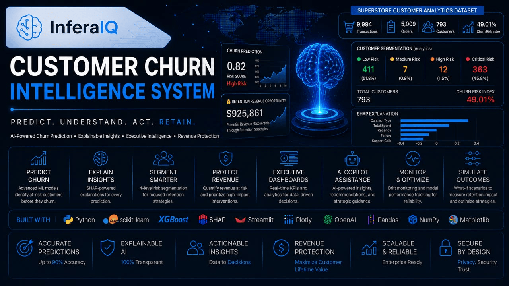

# 🚀 Customer Churn Intelligence System

<p align="center">
  
</p>

<div align="center">


</div>

---

## 🌐 Live Demo

🚀 **Application:** *(Add your Streamlit deployment URL here after deployment)*

---

## 📖 Overview

An enterprise-grade AI-powered retention intelligence platform that predicts customer churn, explains prediction drivers using Explainable AI (SHAP), quantifies revenue risk, and delivers executive-level business insights for proactive customer retention strategies.

Built with **Python, XGBoost, SHAP, OpenAI, and Streamlit**, the platform transforms customer data into actionable business intelligence and decision support.

---

## 🚀 Why This Project Matters

Customer churn is one of the largest drivers of revenue loss across retail, SaaS, telecommunications, banking, healthcare, insurance, and subscription-based businesses.

Traditional reporting often identifies churn after customers have already disengaged.

This platform demonstrates how machine learning, explainable AI, and business intelligence can be combined to:

* Predict churn before it occurs
* Prioritize retention efforts
* Identify revenue exposure
* Explain model decisions
* Improve customer lifetime value
* Support executive decision-making

---

## 📊 Business Impact

| KPI                            |    Value |
| ------------------------------ | -------: |
| Model Accuracy                 |      90% |
| ROC-AUC Score                  |    0.862 |
| F1 Score                       |     0.67 |
| Customers Analyzed             |      793 |
| Orders Processed               |    5,009 |
| Transactions Analyzed          |    9,994 |
| Churn Risk Index               |   49.01% |
| Revenue Opportunity Identified | $925,861 |

---

## 📂 Dataset

This project was developed using the Superstore Customer Analytics Dataset, containing:

| Metric | Value |
|---------|------:|
| Customers | 793 |
| Orders | 5,009 |
| Transactions | 9,994 |

The dataset was transformed into a customer-level analytical dataset and enriched with churn intelligence features for predictive modeling, customer segmentation, revenue opportunity analysis, and retention strategy evaluation.

---

## 🏆 Project Highlights

✔ End-to-End Machine Learning Solution

✔ Production-Ready Streamlit Application

✔ Explainable AI Using SHAP

✔ OpenAI-Powered Copilot

✔ Executive KPI Dashboard

✔ Revenue Opportunity Intelligence

✔ Customer Risk Segmentation

✔ Batch Prediction Engine

✔ Business-Oriented Decision Intelligence

✔ Interactive Analytics & Reporting

---

## 🎯 Skills Demonstrated

* Machine Learning
* Classification Modeling
* Customer Analytics
* Explainable AI (SHAP)
* Feature Engineering
* Predictive Analytics
* Business Intelligence
* Executive Reporting
* Data Visualization
* AI Application Development
* Streamlit Development
* OpenAI Integration
* XGBoost Modeling
* Decision Intelligence
* Revenue Analytics

---

## 📸 Platform Preview

### Executive Dashboard


### Executive Analytics


### Batch Prediction Engine


### Explainable AI (SHAP)


---

## ✨ Key Features

### Predictive Intelligence

* Customer Churn Prediction
* Churn Probability Scoring
* Risk Classification
* Confidence Scoring
* Batch Prediction Engine

### Explainable AI

* SHAP Feature Attribution
* Local Prediction Explanations
* Feature Impact Analysis
* Transparent Model Decisions
* Business-Friendly Interpretability

### Executive Analytics

* Customer Risk Segmentation
* Customer Health Monitoring
* Revenue Opportunity Analysis
* Customer Portfolio Assessment
* KPI Performance Tracking

### AI Assistance

* OpenAI-Powered Copilot
* Insight Generation
* Strategic Recommendations
* Business Decision Support

### Monitoring & Governance

* Prediction Logging
* Model Monitoring
* Performance Tracking
* Drift Monitoring
* Explainability Monitoring

---

## 💰 Revenue Opportunity Framework

The platform identifies customers most likely to churn and estimates potential revenue exposure, enabling organizations to prioritize retention actions based on business impact rather than intuition.

### Estimated Revenue Opportunity

# $925,861

Potential revenue identified for proactive retention initiatives and churn prevention strategies.

---

## 🧠 Explainable AI (SHAP)

Traditional machine learning models often operate as black boxes.

This platform integrates **SHAP (SHapley Additive exPlanations)** to provide:

* Feature-Level Prediction Explanations
* Driver Analysis for Churn Behavior
* Waterfall Explanations
* Business-Friendly Model Transparency
* Trustworthy AI Decision Support
* Actionable Retention Insights

This ensures that stakeholders understand *why* a prediction was generated, not just *what* was predicted.

---

## ⚙️ Technology Stack

### Machine Learning

* Python
* XGBoost
* Scikit-Learn
* SHAP

### Data Processing

* Pandas
* NumPy

### Visualization & Application Layer

* Streamlit
* Plotly
* Matplotlib

### AI Integration

* OpenAI API

### Development Tools

* Git
* GitHub
* Jupyter Notebook

---

## 📁 Project Structure

```text
customer-churn-intelligence-system/
│
├── app/
│   └── streamlit_app.py
│
├── api/
├── data/
├── logs/
├── models/
├── notebook/
├── src/
├── tests/
│
├── requirements.txt
├── README.md
└── .gitignore
```

---

## 🚀 Installation

### Clone Repository

```bash
git clone https://github.com/Dan-Dam/customer-churn-intelligence-system.git

cd customer-churn-intelligence-system
```

### Create Virtual Environment

```bash
python -m venv venv
```

### Activate Environment (Windows)

```bash
venv\Scripts\activate
```

### Install Dependencies

```bash
pip install -r requirements.txt
```

### Run Application

```bash
streamlit run app/streamlit_app.py
```

---

## 👨‍💻 Connect With Me

### Daniel Damilola Amosun

**Data Scientist | AI Engineer | Analytics Professional**

📧 Email: YOUR_EMAIL_HERE

💼 LinkedIn: https://www.linkedin.com/in/dan-dam-amosun

🐙 GitHub: https://github.com/Dan-Dam

---

## 🏢 Organization

### InferaIQ

**AI, Analytics, and Decision Intelligence Solutions**

Developed under the InferaIQ brand with a focus on:

* Artificial Intelligence & Machine Learning
* Advanced Analytics & Business Intelligence
* Decision Intelligence
* Data Engineering
* Intelligent Automation
* AI Product Development

---

## 📜 License

MIT License

Copyright © Daniel Amosun

---

⭐ If you found this project valuable, consider giving the repository a star.
